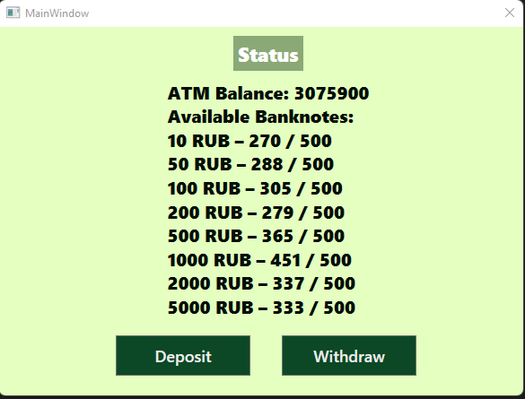
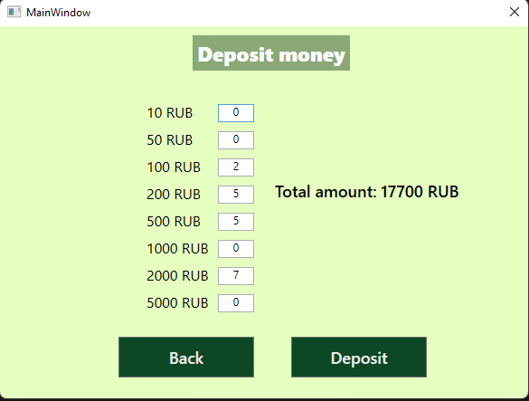
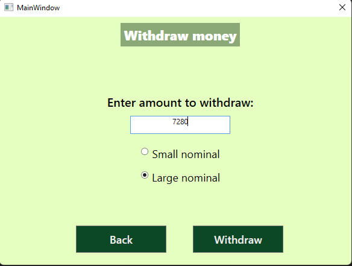

# Банкомат
Банкомат умеет: 
- принимать
- выдавать деньги 
- отображать свое состояние (баланс, наличие, номинал и количество банкнот)

Банкомат имеет ограниченое количество хранимых купюр. Помимо этого есть возможность выдаче денег крупным и мелким номиналом.

## Технологии
- С#
- WPF

## Использование
Исходный код представлен проектом для Visual Studio. Запустить его можно файлом ATM_WPF.sln.

На рисунках представлен внешний вид программы.

__Главное окно программы.__ 
Здесь расположена информация о состоянии и две кнопки для депозита и снятия средств соотвественно.

__Окно депозита средств.__ 
В указанных textBox полях можно задать количество вносимых купюр. 
"Total amount" отображает суммы выбранных купюр.
Кнопка "Back" возвращает на главный окно.
Кнопка "Deposit" производит депозит средств в банкомат.

__Окно вывода средств__
На нём расположено поле ввода количества средств для вывода и кнопки для выбора типа номинала.
Кнопка "Back" возвращает на главный окно.
Кнопка "Withdraw" производит выдачу средств из банкомата.

